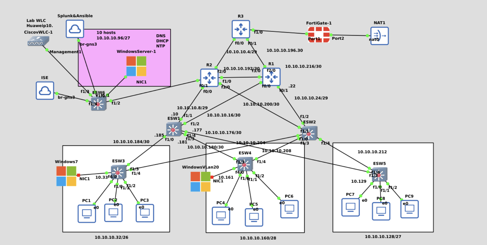

# Networking-Simulation
# Enterprise-Grade Network Security Lab (GNS3 + ISE + WLC + AD + FortiGate HA + Splunk)

Hi!

Thanks for being here.

This lab simulates a full enterprise-grade network infrastructure using GNS3. It includes multi-area dynamic routing (OSPF), HSRP for gateway redundancy, VLAN segmentation, FortiGate firewalls in HA mode, Cisco ISE for wired/wireless 802.1X authentication, Active Directory (DNS, DHCP, NTP, SNMP), Splunk for centralized logging, and simulated wireless using Cisco vWLC. A VPN gateway and full wired/wireless NAC policy enforcement are also part of the final build plan. I wanted to create this lab to keep sharp my knowledge about multiple solutions at the same time as:

* Server virtualisation
* ISE solutions
* Routing/Switching
* Network security
* Windows Server
* vWLC solutions
* Fortigate configurations
* ASA/Firepower configurations
* AnyConnect and S2S VPN
* Redundancy in networking

A fair point to state is that the more I add to this network the more possibilities and room for improvement I see. This lab repo will be constantly updated, I appreciate your interest and feel free to suggest me upgrades, ask questions, or point out mistakes on **rstmduran@gmail.com** .

**NOTE**:
**Planned and performed changes will be listed under [Updates](./Updates/) directory on chronological order.**
x


> 💡 This lab is deployed and tested on **GNS3 running on Linux (Kali)**. The Splunk server is hosted on an **Ubuntu VM inside Virtual Machine Manager (virt-manager)**. The Ubuntu VM uses a **bridged interface** to get internet access and participate in the GNS3 virtual network.

---

## 📊 Topology




---

## 🎯 Lab Goals

- Simulate a resilient and realistic enterprise network infrastructure
- Implement OSPF with multi-area design
- Use HSRP for core router redundancy
- Integrate FortiGate firewalls in HA mode (Active-Passive)
- Deploy Cisco ISE for 802.1X and MAB-based access control
- Integrate Windows Server for AD, DHCP, DNS, and NTP
- Enable wireless access with Cisco vWLC and RADIUS authentication
- Use Splunk to collect logs from network devices and ISE
- Simulate VPN remote access
- Demonstrate real-world access control, segmentation, and monitoring

---

## 🧱 Components

| Component      | Role/Function                                       |
| -------------- | --------------------------------------------------- |
| GNS3           | Core network simulation platform (Linux host)       |
| Cisco Routers  | Core layer with OSPF + HSRP                         |
| FortiGate      | Edge firewall with HA (Active-Passive) + NAT        |
| L3 Switches    | VLANs, SVIs, DHCP relays, access control enforcement|
| Cisco ISE      | RADIUS, 802.1X, MAB, NAC, dynamic VLAN assignment   |
| Windows Server | AD, DNS, DHCP, NTP, SNMP                            |
| Splunk         | Centralized logging and event monitoring (Syslog)   |
| Cisco vWLC     | Wireless LAN Controller with SSID auth via ISE      |
| Client VMs     | Wired and wireless simulation of users (Win/Linux)  |
| VPN Gateway    | Secure remote access endpoint (OpenVPN or Cisco)    |
| Windows Client | Dummy windows client to test ISE + AD configurations|
---

## 🗺️ Network Design

### 🔁 Routing:
- OSPF Area 0 for backbone links
- Area 1 for LAN subnets
- Area 2 for FortiGate and external-facing zones
- FortiGate injects default route into OSPF domain

### 🔄 High Availability:
- R1/R2 run HSRP for gateway redundancy with IP SLA tracking
- FortiGate is configured in HA Active-Passive mode

### 🌐 VLAN Plan:

| VLAN | Name           | Subnet          | Purpose                        |
| ---- | -------------- | --------------- | ------------------------------ |
| 10   | Users          | 10.10.10.0/26   | Authenticated clients (wired)  |
| 20   | Guests         | 10.10.10.64/27  | MAB/guest VLAN                 |
| 30   | Security Ops   | 10.10.10.96/27  | Splunk, Admin, Syslog zone     |
| 40   | Infrastructure | 10.10.10.128/27 | AD, DNS, DHCP, NTP, ISE        |
| 50   | Wireless Mgmt  | 10.10.10.160/28 | WLC, APs, WPA2-Enterprise      |

---

## 🔧 Setup Steps (Chronological)

### 1. OSPF Configuration

- Multi-area OSPF setup on all routers and FortiGate
- Passive interfaces enabled
- FortiGate injects `0.0.0.0/0` as default route

### 2. HSRP on Core Routers

- R1 as active, R2 as standby with preemption
- Virtual IP used by VLANs as default gateway
- IP SLA tracking configured to detect FortiGate failure

### 3. FortiGate HA Setup

- Heartbeat links configured between FG1 and FG2
- Session pickup and sync enabled
- Interfaces matched and priority set

### 4. Layer 3 Switching

- SVIs created for each VLAN
- DHCP relay configured:
  ```bash
  interface vlan 10
   ip helper-address 10.10.10.130

* Trunk links to routers and between switches

### 5. Deploy Base Servers

* Windows Server: AD, DHCP, DNS, NTP
* Splunk (Ubuntu VM): Log collector
* ISE deployed via QEMU or VMware

### 6. ISE Configuration

* Add all network devices (switches, WLC)
* Define authentication and authorization policies
* Setup dynamic VLAN assignment
* Optional internal CA + endpoint profiling

### 7. Switch Dot1X Config

```bash
aaa new-model
radius-server host 10.10.10.130 key ise_secret
ip radius source-interface vlan 40
dot1x system-auth-control
interface FastEthernet0/1
 switchport mode access
 authentication port-control auto
 dot1x pae authenticator
 spanning-tree portfast
```

### 8. Wireless Setup

#### Option A: hostapd

* Linux VM acts as open-source AP using WPA2-Enterprise
* ISE used as RADIUS backend

#### Option B: Cisco vWLC

* Deployed in VLAN 50
* SSIDs mapped to VLANs
* Authentication forwarded to ISE
* Wireless clients simulate WPA2-Enterprise behavior

### 9. Splunk Logging

* Configure syslog on network devices:

  ```bash
  logging host 10.10.10.110
  logging trap informational
  ```
* Forward ISE logs to Splunk on UDP port 514
* Create dashboards for:

  * 802.1X events
  * HSRP status
  * Interface tracking

### 10. User Simulation

* VPCS or Windows/Linux VMs used as clients
* Connect to 802.1X-enabled access ports
* Trigger MAB or .1X authentication
* Validate VLAN assignment via ISE logs and Splunk

---

## ⚠️ Setup Challenges & Fixes

* **GNS3 interface flapping**: Re-created links, hardcoded duplex
* **ARP "incomplete"**: Caused by GNS3 desync, resolved with link recreation
* **Bridging setup**: Manual setup of `br0` and `tap0` on Linux
* **ISE resource demand**: Minimum 12 GB RAM + long boot time
* **Splunk capture**: Needed proper UDP forwarding rules
* **Permissions**: Added user to groups for QEMU and Wireshark

---

## 🧠 Future Improvements (Planned)

* [ ] VPN Gateway for remote access (OpenVPN or Cisco)
* [ ] Add BGP to simulate ISP with FortiGate redistribution
* [ ] Export NetFlow/IPFIX to Splunk
* [ ] Configure guest web portal with ISE
* [ ] TrustSec simulation (if supported)
* [ ] Automate deployment with Python (Netmiko/Nornir)
* [ ] Add attack simulations (e.g., MAC spoof, rogue DHCP)
* [ ] Add a backup Server vlan for seamless transition in case one or more servers are not reachable

---

## 📂 Additional Files

All configs will be available in the `/configs` directory:

* Router configs (HSRP, OSPF, IP SLA)
* Switch VLAN + SVI + Dot1X configs
* FortiGate HA + routing + NAT configs
* ISE device policies and authentication rules
* vWLC SSID and RADIUS configs
* Splunk syslog receiver configs
* VPN setup scripts (TBD)

---

## 💡 Design Justification

* **OSPF + Areas**: Promotes modular routing and fast convergence
* **HSRP + IP SLA**: Gives gateway failover with detection of edge failure
* **FortiGate HA**: Realistic enterprise firewall resilience
* **ISE + VLANs**: Centralized, identity-based access control
* **Splunk Logging**: Real-time monitoring and historical analysis
* **GNS3 on Linux**: Full control over virtual bridge/tap routing and VM orchestration
* **Wireless Simulation**: Emulates real-world 802.1X and guest onboarding

## 🔄 Example Authentication Workflow

1. A Windows 7 client is plugged into ESW3 on a .1X-enabled port.
2. The switch sends EAP-Request to the client.
3. The client authenticates using its AD credentials (verified by ISE via RADIUS).
4. ISE performs posture check (OS, AV, domain).
5. If compliant:
   - ISE assigns VLAN 10 (Users) via dACL or VLAN override.
   - Syslog of the authentication is forwarded to Splunk.
6. If non-compliant or MAB:
   - ISE places client in VLAN 20 (Guest).

```
